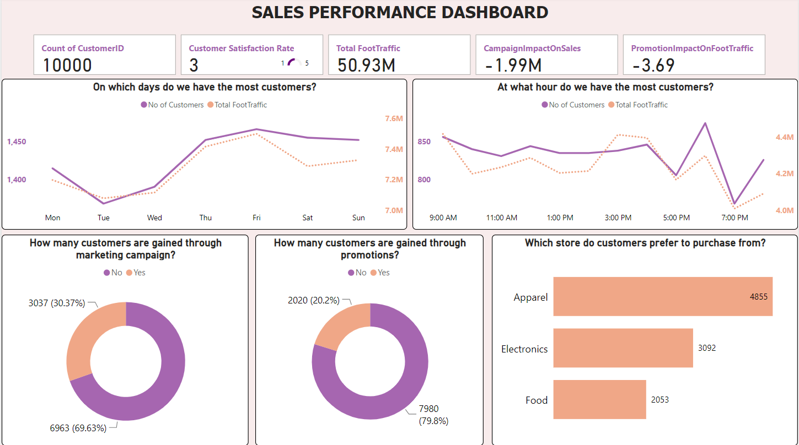

# ANALYSIS OF SALES AND CUSTOMER BEHAVIOR AT FASHION FORWARD MALL USING POWER BI

## PROBLEM STATEMENT:  
Fashion Forward Mall has observed fluctuating foot traffic and inconsistent sales patterns across its various stores. The mall management wants to understand the factors driving these fluctuations to enhance customer experience and optimize store performance. Key objectives include identifying peak shopping times, understanding customer preferences, and determining the impact of marketing campaigns and store promotions on sales.

## OBJECTIVES
1. Analyze foot traffic patterns to identify peak shopping hours and days.
2. Determine customer preferences in terms of store types (e.g., apparel, electronics, food).
3. Evaluate the effectiveness of marketing campaigns and promotions on sales.
4. Provide actionable insights to improve customer experience and boost overall sales.

**Research Questions:**
1.	What are the peak shopping hours and days at Fashion Forward Mall?
2.	Which store types attract the most customers?
3.	How do marketing campaigns and store promotions impact sales and foot traffic?
4.	What factors contribute to the fluctuations in foot traffic and sales?

## DASHBOARD

## TECH STACK: 
- PowerBI

## INSIGHTS:  

**Relationship Insights:**
- Revenue and Customer Count by Hour: There is a strong positive correlation (0.75) between revenue and the number of customers per hour. This means that as the number of customer’s increases, revenue tends to increase significantly.
- Foot Traffic and Customer Count by Hour: Foot traffic and the number of customers per hour also show a strong positive correlation (0.75). More foot traffic leads to more customers.
- Revenue and Foot Traffic by Hour: There is a very weak positive correlation (0.16) between revenue and foot traffic by hour, indicating that foot traffic alone doesn’t significantly predict revenue on an hourly basis.

**Store Performance:**
- Apparel Store: The apparel store leads in revenue, foot traffic, and the number of customers.
- Electronics Store: The electronics store ranks second, with high revenue, foot traffic, and customer count. Although it falls behind the apparel store, it still performs well.
- Marketing Campaigns and Promotions: Despite the high foot traffic, revenue, and customer purchases, the data shows that 69.71% of foot traffic, 69.88% of revenue, and 69.63% of purchases occurred without any marketing campaigns. Similarly, 79.8% of customer purchases and 79.81% of revenue happened without promotions. This suggests that the current marketing campaigns and promotions might not be effectively driving sales or foot traffic.

## RECOMMENDATIONS:  

- Reevaluate marketing and promotional strategies or explore alternative methods to boost their effectiveness.
- Focus on optimizing operations and staffing for peak times (e.g., 6:00 PM) and days (e.g., Friday). Conversely, develop strategies to boost performance on lower-performing days like Tuesday.
- Since the apparel store outperforms others, understanding and leveraging its successful strategies could be beneficial. Replicate its foot traffic-driving techniques across other stores.

<a href="Visualization/FASHION-FORWARD MALL_Report.pptx">Click Here to Download the PowerPoint Report for Full Insights and Recommendations</a>
